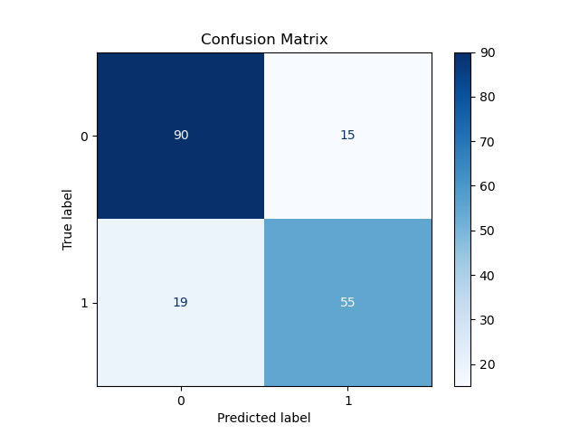
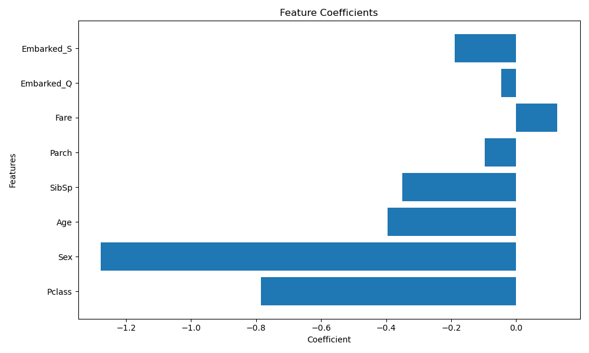

# 🚢 Titanic Survival Prediction using Logistic Regression

## 📌 Project Overview

This project predicts whether a passenger survived the Titanic disaster using **Logistic Regression**. The model was trained using passenger information such as passenger class, age, gender, fare, family members aboard, and embarkation port to classify survival outcomes.

---

## 📂 Dataset

The dataset contains information about Titanic passengers, including:

- Passenger Class (Pclass)
- Sex
- Age
- Number of Siblings/Spouses Aboard (SibSp)
- Number of Parents/Children Aboard (Parch)
- Fare
- Port of Embarkation (Embarked)

**Target Variable:**

- Survived (0 = Did Not Survive, 1 = Survived)

---

## 🛠️ Technologies Used

- Python
- Pandas
- Matplotlib
- Scikit-learn
- Jupyter Notebook

---

## 🔄 Project Workflow

- Data Loading
- Data Exploration
- Missing Value Handling
- Data Preprocessing
- Label Encoding
- One-Hot Encoding
- Feature & Target Selection
- Train-Test Split
- Feature Scaling
- Logistic Regression Model
- Model Training
- Prediction
- Model Evaluation
- Confusion Matrix
- Classification Report
- Feature Coefficients Analysis
- Feature Coefficients Visualization

---

## ⚙️ Model Parameters

The Logistic Regression model was built using the following parameters:

- random_state = 42
- StandardScaler for Feature Scaling

---

## 📊 Model Performance

| Metric | Value |
|---------|------:|
| Accuracy | **0.8101** |
| Precision | **0.7857** |
| Recall | **0.7432** |
| F1 Score | **0.7639** |

---

## 📈 Confusion Matrix

---

## 📉 Feature Coefficients

---

## 📌 Conclusion

The Logistic Regression model successfully classified Titanic passenger survival based on the selected features. After preprocessing the data and training the model, it achieved an **Accuracy of 81.01%**, along with a **Precision of 78.57%**, **Recall of 74.32%**, and an **F1 Score of 76.39%**.

The feature coefficient analysis also provides insight into how each feature influences the prediction, making the model both effective and interpretable for this binary classification problem.

---

## 🚀 Future Improvements

- Perform Hyperparameter Tuning using GridSearchCV or RandomizedSearchCV.
- Compare performance with K-Nearest Neighbors (KNN), Decision Tree, and Random Forest Classifier.
- Evaluate the model using Cross-Validation.
- Deploy the trained model as a web application using Flask or Streamlit.
